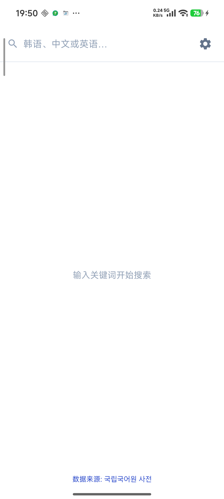
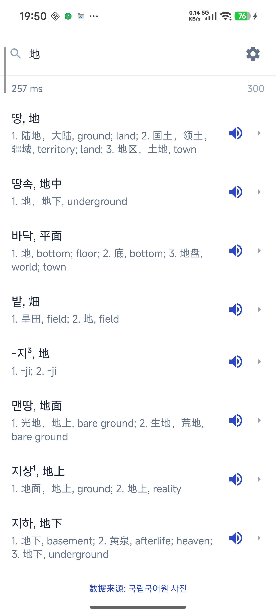
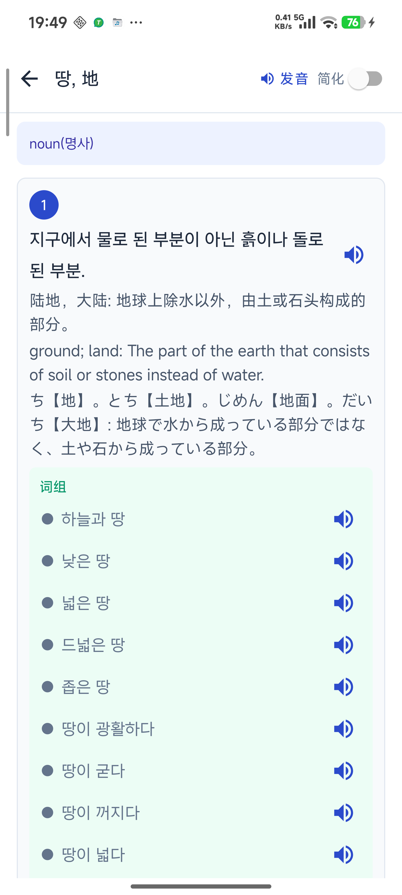
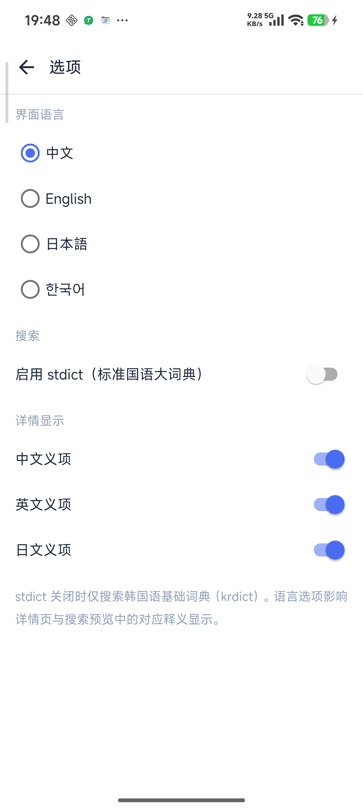

# KrDict Android

[中文](README.md) · **English**

An offline Korean dictionary Android app powered by [국립국어원 사전 / korean-dict-nikl](https://github.com/spellcheck-ko/korean-dict-nikl). Supports Korean/Chinese/English/Japanese definitions, full-text search, TTS, and a four-language UI.

## Download

| File | Description |
|------|-------------|
| [krdict.apk](krdict.apk) | APK (75.3 MB, includes offline dictionary data) |

**Entries:** **54,839** from [krdict](https://krdict.korean.go.kr/) by default; **410,934** total with stdict enabled

**Requirements:** Android 7.0 (API 24) or later

### Installation

1. Download `krdict.apk` to your phone
2. Allow installation from unknown sources (path varies by device)
3. Tap the APK to install
4. On first launch the app extracts the dictionary database — wait a moment, then search

## Screenshots

| Home | Search results |
|:---:|:---:|
|  |  |

| Entry detail | Settings |
|:---:|:---:|
|  |  |

## Features

- **Offline lookup** — Built-in dictionary data; auto-extracts on first launch, no network required
- **Multilingual search** — Korean, Chinese, and English keywords
- **Entry detail** — POS, etymology, conjugation, Chinese/English/Japanese definitions, phrases and examples in separate sections
- **Simple mode** — Toggle a condensed definition view on the detail page
- **TTS** — Speak headwords, examples, and selected text (Korean voice pack required)
- **Text selection** — Long-press to copy, speak, or search
- **stdict toggle** — Optionally include entries from the Standard Korean Dictionary (stdict)
- **UI language** — Chinese / English / Japanese / Korean

## Data source

Dictionary data comes from [spellcheck-ko/korean-dict-nikl](https://github.com/spellcheck-ko/korean-dict-nikl), based on open data from the National Institute of Korean Language under [CC-BY-SA 2.0 KR](https://creativecommons.org/licenses/by-sa/2.0/kr/).

- [Korean Learners' Dictionary (krdict)](https://krdict.korean.go.kr/)
- [Standard Korean Dictionary (stdict)](https://stdict.korean.go.kr/)

In the app, tap **Data source: [국립국어원 사전](https://github.com/spellcheck-ko/korean-dict-nikl)** at the bottom to open the upstream repository.

> This is an unofficial derivative of NIKL dictionary data. See the upstream repo for restrictions on example sentences and media files.

## Repository contents

```
.
├── README.md
├── README.en.md
├── krdict.apk          # APK
└── screenshots/        # App screenshots
```